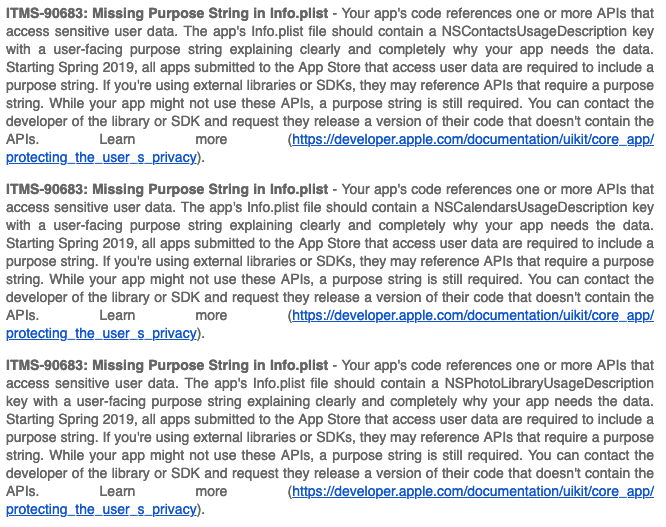

由於最近工作上在寫 Flutter，而最近這專案差不多要結束了，所以負責把這個 app 上架到 app store 上，中間也是遇到不少令人疑惑的問題，因此在這邊紀錄一下，將來有機會遇到的時候，應該比較容易回憶起來。

## 基礎知識

首先，先來了解一下一個 iOS app 如果要能在 device 上運作，需要什麼東西：

1. certificate
   - 用來證明是誰發布這個 app 的。
2. identifier
   - 必須是全世界唯一的識別碼。
3. provision profile
   - 一個配置文件，用來描述在 device 上需要用到什麼服務。

### Certificate

Certificate 是用來證明這個 app 是我們發佈的，這樣 device 才可以安心的安裝這個 app，而不會安裝到來路不明的 app，所有的 certificate 都統一由 apple 來發送。

為了申請一個 Certificate，首先需要建立一個 csr (certificate signing request)，參照這個[回答](https://stackoverflow.com/a/45504269)，我們可以從 keychain 中建立 csr，要注意的是 common name 會顯示在 keychain 上面，所以記得取一個比較容易辨識的名字，像 `my_ios_distribution` 之類的。

經過上面的步驟得到 csr 之後，就可以到 apple developer 上建立 certificate，上傳 csr 之後，apple 就會讓我們下載一個 cer (certificate)，但事情還沒結束！這個 cer 只是 apple 發給我們的憑證，但是這個憑證還不能拿來 sign app，因為這個憑證只是 public key，而我們要使用 private key 來 sign app 才行，這個 cer 只是代表如果我們用 private key 來 sign app 之後， apple 會能夠驗證這個 app 是由我們發布的。

在建立 csr 的時候，就會自動建立一個 private key，當我們拿到 cer 之後，點兩下來 import 到 keychain，接下來照這個[回答](https://stackoverflow.com/a/44696730)我們就可以透過 keychain 來匯出 p12 (Public Key Cryptography Standards) 包含 private key 和 certificate。

有了這個 p12，我們就可以在任何電腦上來 sign app 了，這對於持續發布是非常重要的，如果只是要在自己的電腦上 sign app 的話，那就不需用輸出這個 p12 了，因為自己的電腦就包含了 private key & certificate 了。

### Identifier

在開發 app 的時候，都要輸入一個 app id (identifier)，而這個 app id 必須是全世界唯一的，出現在 A account，就不能出現在 B account，所以在開發 app 的時候常常會看到什麼要換個 unique 的 id，就是因為被別人搶走了。

在 apple developer 的網頁上，我們可以註冊這個 identifier，這在之後建立 provision profile 的時候會用到，並且在建立 identifier 的時候，需要選擇這個 app 能做到什麼事情，像是 push notification 之類的，都是在建立 identifier 的時候做選擇。

### Provision Profile

這是一個配置文件，讓 device 知道我們這個 app 需要用到什麼服務，如果 profile 上的描述不符合 device 上的情況的話，聽說 app 就開不了了，當然我沒遇過所以也不清楚。

在 apple developer 網站上建立 provision profile 的時候，會需要選擇 certificate & identifier，這邊就是在連結這個 app 能做到的事情，以及用來 sign 的 certificate。

建立 profile 的時候，會需要選擇是開發用的還是發布用的，發布用的比較複雜，要選擇發布到哪裡，如果沒有選對，就要重建立一次，像 Ad-Hoc 就是用來測試用的，在 apple developer 上註冊的 device 就可以安裝這個 app，app store 就是用來發布的，用來上傳到 itunes connect 的。

## 發布 app

這邊是一些發布 app 用的 script，因為我是寫 flutter 的，所以 build script 主要是以 flutter 為主。

```bash
# create application bundle
flutter build ios --verbose --flavor ${FLAVOR} --no-codesign --quiet --release --build-number ${BUILD_NUMBER}
# create build archive
xcodebuild -workspace ./ios/Runner.xcworkspace -scheme ${FLAVOR} -sdk iphoneos -configuration Release-${FLAVOR} archive -archivePath ./build/${MY_APP}_${FLAVOR}.xcarchive -quiet
# export xcarchive to ipa
xcodebuild -exportArchive -archivePath ./build/${MY_APP}_${FLAVOR}.xcarchive -exportOptionsPlist ${EXPORT_OPTIONS_PLIST_PATH} -exportPath ./build/${MY_APP}_${FLAVOR}.ipa -quiet
# upload ipa to itunes connect
xcrun altool --upload-app --type ios --file ${IPA_PATH} --username ${USERNAME} --password ${PASSWORD}
```

這邊的 `flavor` 指的是 xcode 上的 scheme，這個專案為了在不同的 build 上使用不同的 crashlytics，所以有多個 scheme，如此一來可以寫一個 build script，針對不同的 scheme 來使用不同的 `GoogleService-Info.plist`。

當專案有個不同的 scheme，我們就沒辦法使用 xcode 來 archive 了，因為 xcode 的 archive 在我使用的時候，並不會指定 flavor，導致 archive 會失敗，所以這邊我們使用 command line 來執行，再說，我們的最終目標就是自動化，為此將所有步驟指令化是早晚都要做的。

產生了 `.xcarchive` 之後，我們就可以來將 archive 轉成 ipa 了，要注意的是，第一次 export 時，因為我們並沒有 `ExportOptions.plist`，所以要使用 xcode 來 export，只要使用 `open ${ARCHIVE_PATH}` ，xcode 就會開啟 archive。

最後就是上傳 ipa 到 itunes connect 了，這邊要先在 itunes connect 上建立對應的 app 才能上傳，不然會有找不到對應的 app 的錯誤訊息，要注意的是，每個 build number 只能上傳一次，所以每次上傳時 build number 都必須是唯一的。

上傳之後要等 apple 驗證一下 app 有沒有把該填的資料都填一填，驗證完之後會送一封信到信箱，說明是通過了，還是缺少什麼資料，如果有缺少資料，那信的內容大概是長這樣。


根據上面信封來修改 app 的一些設定，在上傳一次就行惹，之後就可以到 TestFight 邀請測試人員來測試這些 app。

## Reference

- https://medium.com/@abhimuralidharan/what-is-a-provisioning-profile-in-ios-77987a7c54c2
- https://help.apple.com/xcode/mac/current/#/dev60b6fbbc7
- https://kknews.cc/zh-tw/news/rrx9e6v.html
- https://www.itread01.com/p/376503.html
