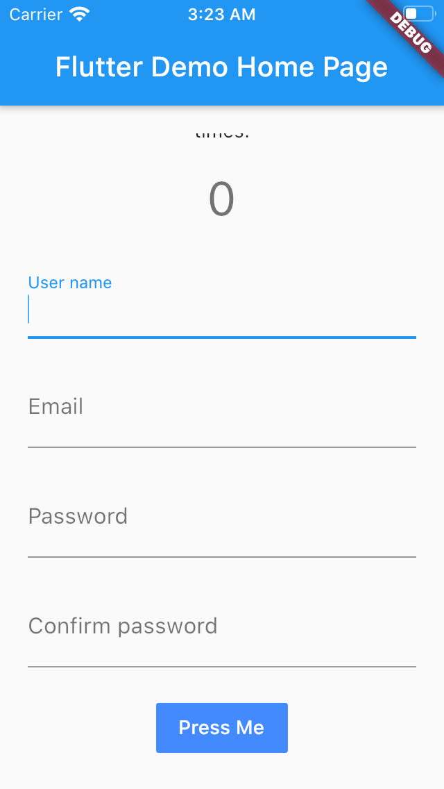

今天來介紹一下 `IntrinsicHeight` 這個官方說很好用但不要常用的 widget 。

官方介紹：https://api.flutter.dev/flutter/widgets/IntrinsicHeight-class.html

官方的說明是說這個 widget 會讓高度剛好等於 children 的高度，主要是用在處理在 unlimited height 的情況下，不想要 unlimited height 的時候使用。

一時之間是很難想到這個 widget 有什麼用處，讓我舉一個例子就非常容易了解了，假設我們有一個 form 要給 user 填寫，並且我們希望 submit button 會黏在畫面的最底部像下圖。

```
+----------------------+
|                      |
|  User name           |
|  +----------------+  |
|  |     Input      |  |
|  +----------------+  |
|                      |
|  Email               |        Column(
|  +----------------+  |          children: [
|  |     Input      |  |            TextField(),
|  +----------------+  |            TextField(),
|                      |            TextField(),
|  Password            |            Spacer(),
|  +----------------+  |            FlatButton(),
|  |     Input      |  |          ],
|  +----------------+  |        )
|                      |
|                      |
|  +----------------+  |
|  |     Submit     |  |
|  +----------------+  |
+----------------------+
```

上面這個畫面，在 iPhone X 上，可以完整地顯示，沒有問題，但是在 iPhone SE 上沒辦法顯示，一個簡單的做法就是在 `Column` 外加上一個 `SingleChildScrollView`, 讓這個 `Column` 變得可以 scroll，問題在於 `SingleChildScrollView` 會讓 `Column` 有無限的高度，這樣 `Spacer` 就不能夠運作了，進而導致 button 沒辦法黏在底部！

這時候我們就可以使用 `IntrinsicHeight` 了，不過還是需要搭配其他 widget 來做就是了，下面是一個範例 widget tree 跟說明。

```dart
Scaffold(
  appBar: AppBar(
    title: Text(widget.title),
  ),
  body: Padding(
    padding: const EdgeInsets.all(20),
    child: LayoutBuilder(
      // 用來取得可以繪製 widget 的範圍
      builder: (context, constraints) {
        return SingleChildScrollView(
          child: ConstrainedBox(
            // 限制 single child scroll view 最小範圍為可繪製範圍的最大範圍
            // 通常就是 parent size 去掉 padding and margin
            // 並讓最大範圍為無限，這樣當內容超過 minHeight 的時候才會變成可以 scroll
            constraints: constraints.copyWith(
              minHeight: constraints.maxHeight,
              maxHeight: double.infinity,
            ),
            // IntrinsicHeight 在這邊的作用，就是讓 Spacer 可以正常運作。
            // 上面的 ConstrainedBox 已經強迫讓 IntrinsicHeight 最小會等於可繪製的最大高度
            // 所以當內容小於設定的 minHeight 的話，Spacer 就會佔據多餘的空間
            // 當超過 minHeight 的時候，因為 IntrinsicHeight 會讓 child 的高度剛好為 child's 的高度
            // 所以Spacer 不會佔據任何空間
            child: IntrinsicHeight(
              child: Column(
                mainAxisAlignment: MainAxisAlignment.center,
                children: [
                  Text(
                    'You have pushed the button this many times:',
                    textAlign: TextAlign.center,
                  ),
                  SizedBox(height: 20),
                  Text(
                    '$_counter',
                    style: Theme.of(context).textTheme.headline4,
                  ),
                  SizedBox(height: 20),
                  TextFormField(
                    decoration: InputDecoration(
                      labelText: 'User name',
                    ),
                  ),
                  SizedBox(height: 20),
                  TextFormField(
                    decoration: InputDecoration(
                      labelText: 'Email',
                    ),
                  ),
                  SizedBox(height: 20),
                  TextFormField(
                    decoration: InputDecoration(
                      labelText: 'Password',
                    ),
                    obscureText: true,
                  ),
                  SizedBox(height: 20),
                  TextFormField(
                    decoration: InputDecoration(
                      labelText: 'Confirm password',
                    ),
                    obscureText: true,
                  ),
                  SizedBox(height: 20),
                  Spacer(),
                  FlatButton(
                    color: Colors.blueAccent,
                    textColor: Colors.white,
                    child: Text('Press Me'),
                    onPressed: _incrementCounter,
                  ),
                ],
              ),
            ),
          ),
        );
      }
    ),
  ),
);
```

| iPhone SE                              | Note 9                          |
| :------------------------------------- | :------------------------------ |
|  |  |
